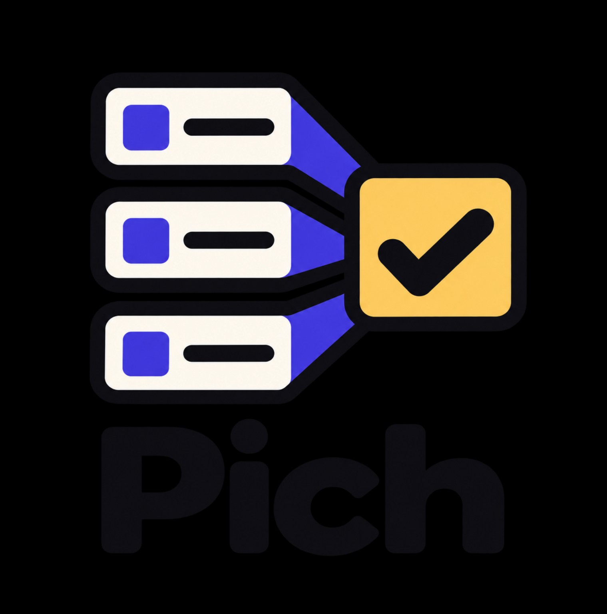
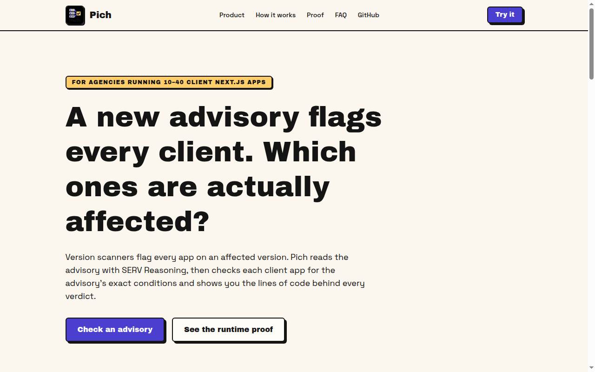
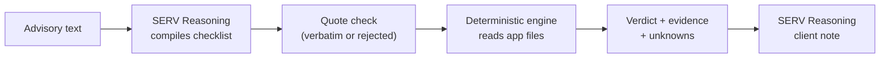
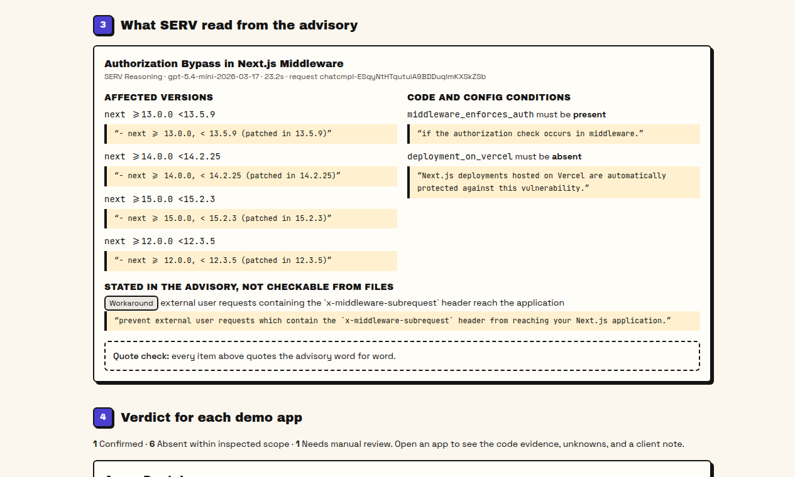
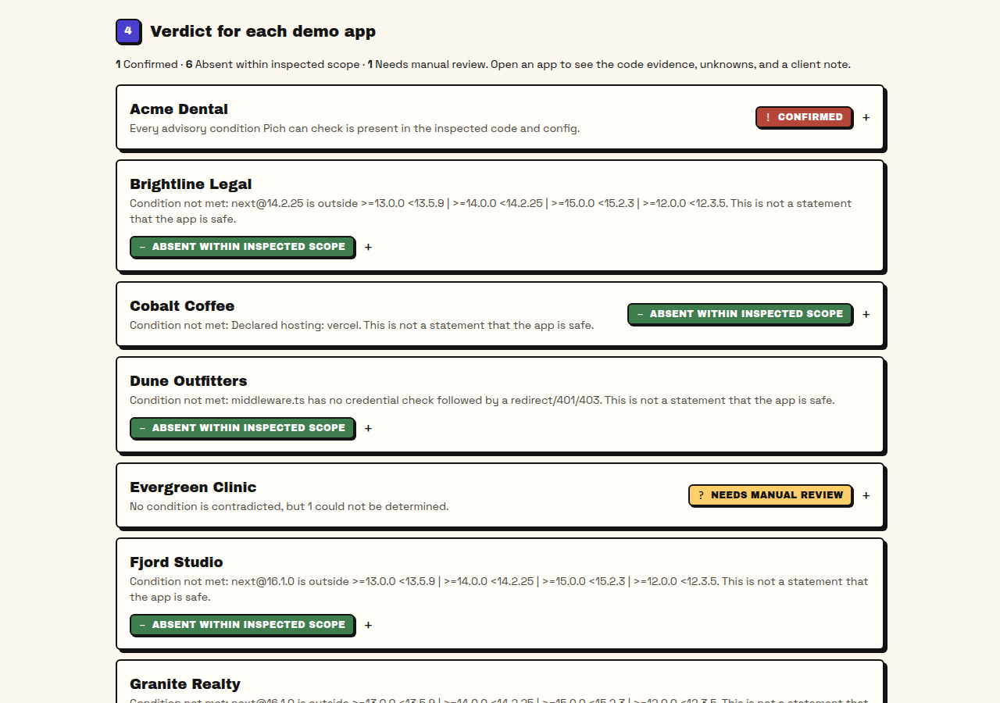
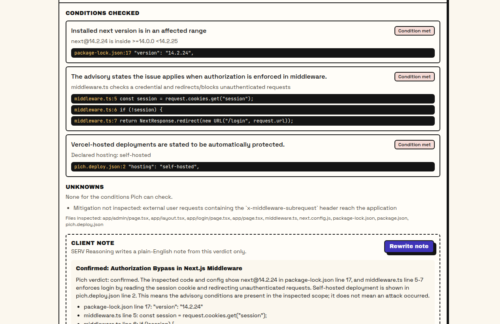
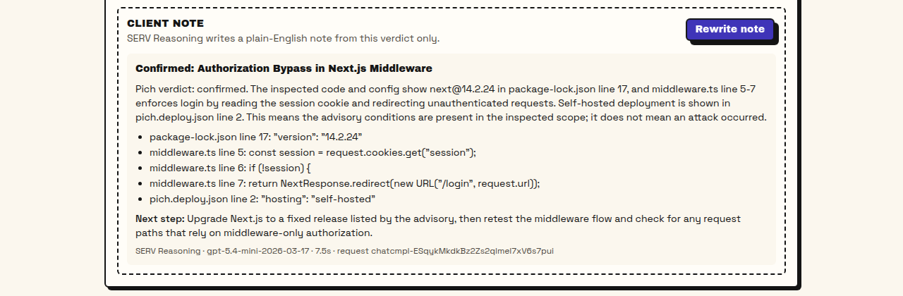
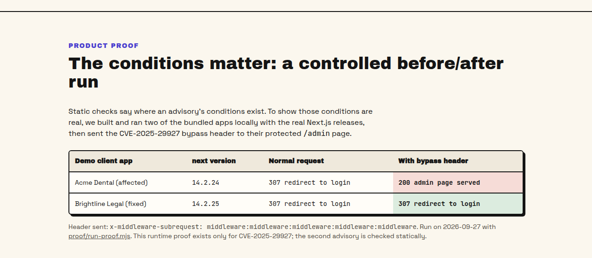
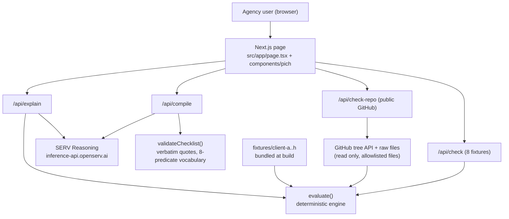

<p align="center"></p>

# Pich

**A new Next.js security advisory lands. Pich tells an agency which of its client apps are actually affected, with the lines of code to prove it.**

**Live demo:** https://pich-dev.vercel.app · **Built with:** OpenServ SERV Reasoning · Next.js · Vercel · **License:** MIT



| You give Pich | SERV Reasoning does | Pich returns, per app |
| --- | --- | --- |
| An advisory (pick one or paste it) and your apps (8 demo apps or a public GitHub repo) | Turns the advisory text into a checklist of versions and conditions, each backed by a word-for-word quote | **Confirmed**, **Absent within inspected scope**, or **Needs manual review**, with file-and-line evidence, the unknowns, and a client-ready note |

Status: working deployment. Pich reads files as text and never runs your code.

---

## The problem

An agency looks after 10 to 40 client Next.js apps. When an advisory like CVE-2025-29927 comes out, version scanners flag every app on an affected version. Most advisories also have conditions: "only if auth runs in middleware", "not on Vercel", "only with Turbopack and a single locale". Checking those by hand across every client takes days, so the agency either panics everyone or guesses.

## What Pich does

Pich checks the advisory's actual conditions in each app, not just the version number. Every app gets exactly one of three verdicts:

| Verdict | Meaning |
| --- | --- |
| **Confirmed** | Every condition Pich can check is present in the code and config. This is not proof an attack happened. |
| **Absent within inspected scope** | At least one required condition was not found in the inspected files. This is not a safety guarantee. |
| **Needs manual review** | Nothing contradicts the advisory, but something could not be decided from files. The unknowns are listed. |

## How it works

1. Pick a supported advisory or paste a new one.
2. SERV Reasoning compiles it into a typed checklist. Every item must quote the advisory word for word.
3. Pich throws out any item whose quote is not in the advisory, then checks each app's files deterministically. No AI decides the verdict.
4. You get a verdict per app with evidence and unknowns. SERV then writes a plain-English note for the client from that verdict only.



## Why SERV Reasoning matters

Without SERV, Pich can only handle advisories someone hand-coded in advance, which is the version-scanner problem again. SERV is what turns a brand-new advisory into a checklist the engine can run. Pich keeps SERV auditable:

- Output uses a strict JSON schema, restricted to 8 checkable predicates (`src/lib/vocabulary.ts`).
- Every range, predicate, and condition carries a `source_quote`. `validateChecklist()` rejects it if the quote is not in the advisory.
- A deterministic guard corrects predicates whose quote says a setup is *protected* but which SERV marked as *required*. We caught this in a live run and added a test for it.
- SERV writes the verdict explanation, but it never decides the verdict.

## Try it (under 2 minutes)

1. Open https://pich-dev.vercel.app and click **Check an advisory**.
2. Keep **CVE-2025-29927** and **8 demo client apps**, then click **Check the 8 demo apps**. SERV takes about 20 seconds.
3. Open **Acme Dental** (Confirmed) to see the evidence, then click **Write client note**.
4. Switch to **My public GitHub repo** and paste any public Next.js repo link.

## Product

| SERV checklist with quotes | Verdicts for 8 client apps |
| --- | --- |
|  |  |

| Code evidence per condition | Client note written by SERV |
| --- | --- |
|  |  |

### Runtime proof (CVE-2025-29927)

Static checks show where the conditions exist. To show the conditions are real, `proof/run-proof.mjs` builds two bundled demo apps locally with the real Next.js releases and sends the bypass header to their protected `/admin` page:

| Demo app | next | No header | With bypass header |
| --- | --- | ---: | ---: |
| Acme Dental (affected) | 14.2.24 | 307 redirect | **200 admin page served** |
| Brightline Legal (fixed) | 14.2.25 | 307 redirect | 307 redirect |



This proof exists only for CVE-2025-29927. The second advisory is checked statically.

## Architecture



One Vercel app serves the page and the API routes. There is no database. The SERV key lives only in the server environment.

| Piece | File | Job |
| --- | --- | --- |
| SERV client | `src/lib/serv.ts` | `compileAdvisory()` and `explainResult()`, strict JSON schema, shadow-agent check |
| Checklist validator | `src/lib/checklist.ts` | Verbatim-quote check, semver validation, polarity guard |
| Engine | `src/lib/engine.ts` | Reads lockfile, router dirs, middleware auth gate, hosting, Turbopack flag, i18n locales |
| Repo reader | `src/lib/github.ts` | Fetches a fixed file list from a public repo, never runs it |
| Fixtures | `fixtures/client-a..h` | 8 demo client apps covering all three verdicts |
| Runtime proof | `proof/run-proof.mjs` | Before/after exploit check on client-a and client-b only |

## Evidence

- `npm test`: 16 of 16 advisory × app verdicts match for CVE-2025-29927 and GHSA-6gpp-xcg3-4w24. Fabricated quotes are rejected and the reversed-polarity guard is tested.
- `RUNS=3 npm run test:serv`: live SERV compiles of both advisories, 3 runs each, and every verdict matches.
- `node proof/run-proof.mjs`: 14.2.24 returns 200 with the bypass header and 14.2.25 returns 307 (`proof/proof-result.json`).
- The live site was checked in a browser against the 8 demo apps and against `vercel/nextjs-subscription-payments`.

## What we tested

| Attempt | Expected | Result |
| --- | --- | --- |
| SERV returns a condition whose quote is not in the advisory | Rejected and shown in the quote check | Rejected in a live run |
| SERV marks "hosted on Vercel is protected" as a required condition | Corrected to absent | Guard added and tested |
| Repo uses pnpm or yarn instead of package-lock.json | Needs manual review, with the reason | Shown as an unknown |
| Hosting not declared | Unknown; Pich does not guess | Shown as an unknown |
| Private or missing repo, or not a Next.js app | Clear error, nothing run | Clear error message |

## Run locally

```bash
npm install
cp .env.example .env.local   # add SERV_API_KEY
npm run dev                  # http://localhost:3000
npm test                     # deterministic engine checks
npm run test:serv            # live SERV checks (needs SERV_API_KEY)
node proof/run-proof.mjs     # runtime proof, needs network to install next
```

## Limitations

- Next.js only, and 8 checkable conditions. Anything else becomes Needs manual review.
- Public GitHub repos only, one at a time. The Next.js version comes only from npm's package-lock.json.
- Hosting is unknown unless the repo has a `pich.deploy.json`.
- There is a runtime proof only for CVE-2025-29927. Patching inside the app is not built.

## Roadmap

- Check all client repos in one run, including private repos through a GitHub App.
- Read pnpm and yarn lockfiles.
- Grow the predicate vocabulary for more advisories.

## License

MIT, see [LICENSE](LICENSE). Security policy: [SECURITY.md](SECURITY.md).
